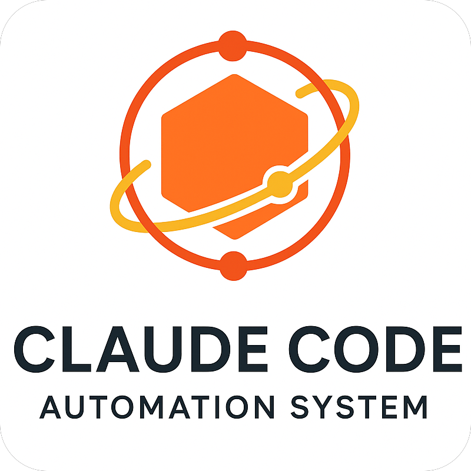

<div align="center">
  
  
# Claude Code Automation System
</div>

[](https://www.python.org/downloads/)
[](https://github.com/anthropics/claude-code)
[](LICENSE)
[](https://claude.ai/code)

**Enhanced Claude Code automation framework with intelligent hooks, custom commands, and bilingual documentation generation.**

This repository provides a sophisticated dual-layer automation system that extends Claude Code's capabilities with context-aware prompt modification, advanced development workflows, and intelligent project analysis.

## Features

### **Native Hook System**
- **UserPromptSubmit Hooks** - Intelligent prompt modification based on context
- **Flag Dispatcher** - Shortcut command flags (`-ut`, `-debug`, `-quick`, etc.) for instant control
- **Ultra Think Mode** - Deep analysis prompts for complex problems
- **Concise Responses** - Automatic short answers for simple queries
- **Learning Support** - Enhanced explanations for educational contexts
- **Digest Mode** - Project-aware `-d` flag processing

### **Custom Command System**
- **11 Specialized Commands** - Advanced development workflow automation
- **Security Analysis** (`/security`) - Multi-layer vulnerability scanning
- **PR Creation** (`/create-PR`) - Intelligent pull request generation
- **Code Refactoring** (`/refactor`) - Context-aware code improvement with branch safety
- **File Review** (`/file-review`) - Comprehensive code analysis
- **Git Commits** (`/git-commit`) - Ultra think-powered commit message generation
- **Project Cleanup** (`/clean-project`) - Safe project cleanup with git protection
- **Bilingual Documentation** (`/create-readme`, `/update-readme`) - English/Chinese README automation with backups

### **Context Intelligence**
- **Project Detection** - Automatic identification of project types (Web, Python, Java, Rust, Go, Docker)
- **Language Analysis** - Smart detection of programming languages and frameworks
- **Git Integration** - Branch tracking, change analysis, and commit intelligence
- **Tool Validation** - Prerequisite checking and environment validation

## Installation

### 🚀 Quick Setup (Recommended)
**Just copy the `.claude/` directory to your existing project - that's it!**

The entire automation system is self-contained in the `.claude/` folder. No project restructuring needed.

```bash
# Method 1: Direct download and extract
curl -L https://github.com/muqy1818/claude-code-automation/archive/master.zip -o automation.zip
unzip automation.zip
cp -r claude-code-automation-master/.claude/ /path/to/your/project/
cd /path/to/your/project/

# That's it! All 11 commands and hook system now available
# Test it works:
echo "test automation -d" | claude
```

### ⚡ Alternative Installation Methods

#### Manual Download
1. Visit the [GitHub repository](https://github.com/muqy1818/claude-code-automation)
2. Download the `.claude/` folder contents
3. Copy to your project root
4. Start using Claude Code in that directory

#### Git Subtree (for Git users)
```bash
cd your-existing-project/
git subtree add --prefix=.claude https://github.com/muqy1818/claude-code-automation.git master --squash
```

#### Full Repository Clone (for development)
```bash
# Only needed for contributing or studying the codebase
git clone https://github.com/muqy1818/claude-code-automation.git
cd claude-code-automation
# Ready for development and testing
```

### ✅ What You Get
Once `.claude/` is in your project:
- **11 specialized commands** (`/security`, `/create-PR`, `/refactor`, etc.)
- **Intelligent hook system** (ultra think, concise responses, digest mode)
- **Context-aware automation** (detects your project type and languages)
- **Safety-first design** (branch protection, backups, dry-run modes)
- **Bilingual documentation** support

### Prerequisites
- **Claude Code CLI** installed and configured
- **Python 3.8+** (for automation framework)
- **Git** (for git-related commands and safety features)
- **Optional**: GitHub CLI (`gh`) for PR creation, Node.js/npm for web projects

## Quick Start

### 1. **Enable Hook System**
The hook system automatically activates when you use Claude Code in this directory:

```bash
# Test the -d digest mode
echo "explain how hooks work -d" | claude

# Test ultra think mode
echo "design a scalable microservices architecture" | claude
```

### 2. **Use Custom Commands**
Access advanced automation with slash commands:

```bash
# Generate security analysis
/security

# Clean project safely (NEW)
/clean-project --dry-run

# Create intelligent README (bilingual)
/create-readme --lang=both --style=standard

# Intelligent PR creation
/create-PR --draft

# Context-aware refactoring (SAFETY: requires new branch)
/refactor --type=performance
```

## Usage

### Hook System
The automation system operates through **two layers**:

#### **Layer 1: Native Claude Code Hooks**
- Modifies prompts before they reach Claude
- Configured in `.claude/settings.json`
- Executes in sequence: flag_dispatcher → ultrathink → answer_in_short → explain → default

```bash
# Examples of hook activation
"complex algorithm design problem"     # → Triggers ultra think
"what is Python?"                      # → Triggers concise response
"help me learn recursion"              # → Triggers explanation mode
"optimize this code -d"                # → Triggers digest mode

# New shortcut flag examples
"design microservices -ut"             # → Force ultra think mode
"analyze this error -debug"            # → Activate debug analysis
"simple question -quick"               # → Force brief answer
"explain concepts -explain"            # → Force detailed explanation
```

#### **Layer 2: Custom Command System**
- Advanced development workflows
- Context-aware execution
- Powered by `/core` Python framework

### Shortcut Flag System

The **flag dispatcher** provides instant control over Claude's response style using shortcut flags:

#### **Available Flags**
```bash
# Core flags (user requested)
-ut              # Ultra Think - deep analysis with comprehensive reasoning
-debug           # Debug Mode - systematic error analysis and troubleshooting

# Additional control flags  
-quick           # Quick Mode - brief, concise answers only (conflicts with -ut, -debug, -explain)
-explain         # Explain Mode - detailed explanations and teaching
-code            # Code Mode - focus on implementation with minimal explanation
-review          # Review Mode - code review with best practices
-secure          # Security Mode - focus on security implications
-optimize        # Optimization Mode - performance and efficiency focus
-refactor        # Refactor Mode - code restructuring suggestions
-test            # Test Mode - testing strategies and implementation
```

#### **Flag Usage Examples**
```bash
# Force ultra think for complex problems
"How should I architect a distributed system? -ut"

# Quick answers for simple questions
"What is Python? -quick"

# Combine compatible flags
"Review this code for security issues -review -secure"

# Debug mode for error analysis
"I'm getting this error: [error details] -debug"
```

#### **Conflict Resolution**
- Conflicting flags (like `-quick` and `-explain`) are automatically resolved
- First detected flag takes priority
- System provides clean, predictable behavior

### Custom Commands

#### **Documentation Commands**
```bash
# Generate new README
/create-readme --lang=en --style=comprehensive
/create-readme --lang=zh --style=minimal
/create-readme --lang=both --style=standard

# Update existing README
/update-readme --sections=installation,usage
/update-readme --lang=both --preserve=true
```

#### **Development Commands**
```bash
# Security analysis
/security secrets              # Scan for hardcoded secrets
/security dependencies         # Check vulnerable dependencies
/security full                # Complete security audit

# Project cleanup (NEW)
/clean-project --dry-run       # Preview cleanup (safe)
/clean-project --mode=moderate # More thorough cleanup
/clean --mode=safe            # Alias for basic cleanup

# Code improvement (SAFETY: Use feature branches)
git checkout -b refactor/improvements
/refactor src/                # Refactor specific directory
/refactor --type=pattern      # Extract patterns and reduce duplication
/file-review --focus=security # Security-focused code review
```

#### **Git Integration**
```bash
# Smart commit generation
/git-commit --dry-run         # Preview generated commit message
/git-commit --type=feat       # Override auto-detection
/commit --style=conventional  # Alias with conventional commits

# Pull request management
/create-PR main               # Create PR against main branch
/create-PR --draft            # Create draft PR
/push-to-github              # Validated git push
/explain-pull-request        # Document architecture changes
```

## Architecture

The system uses a **dual-layer architecture** with comprehensive safety measures:

### **Core Components**
- **Context Manager** (`core/context_manager.py`) - Project intelligence and detection
- **Command Registry** (`core/command_registry.py`) - Command execution and validation  
- **Hook Dispatcher** (`core/hook_dispatcher.py`) - Command-level hook management
- **Native Hooks** (`hooks/UserPromptSubmit/`) - Prompt modification scripts

### **Safety Features**
- **Branch Protection** - Commands that modify files require feature branches
- **Backup Creation** - Automatic backups before destructive operations
- **Dry-run Modes** - Preview changes before execution
- **Git Safety** - Never touches main/master branches for risky operations

### **Configuration System**
- **Native Hooks**: `.claude/settings.json` (Claude Code format)
- **Custom Commands**: `.claude/settings/commands.json` (command definitions)
- **Global Settings**: `.claude/settings/global.json` (system-wide defaults)
- **Project Settings**: `.claude/settings/project.json` (project-specific overrides)

## Bilingual Support

The system provides comprehensive bilingual documentation generation:

### **Language Options**
- `--lang=en` - English documentation (default)
- `--lang=zh` - Chinese documentation
- `--lang=both` - Generate both language versions

### **Technical Approach**
- **English Primary** - Main documentation language
- **Chinese Localization** - Technical accuracy with cultural adaptation
- **Consistent Structure** - Mirrored sections across languages
- **Technical Terms** - Preserves English technical vocabulary

## Contributing

1. **Fork the repository**
2. **Create a feature branch**: `git checkout -b feature/amazing-feature`
3. **Make your changes** and test thoroughly
4. **Run the hook system tests**: Test with various prompt types
5. **Commit your changes**: `git commit -m 'Add amazing feature'`
6. **Push to the branch**: `git push origin feature/amazing-feature`
7. **Open a Pull Request** using `/create-PR` command

### **Development Setup**
```bash
# For contributing to the automation framework itself
git clone https://github.com/muqy1818/claude-code-automation.git
cd claude-code-automation

# Test hook system directly
echo "test prompt -d" | python .claude/hooks/UserPromptSubmit/append_default.py

# Test command system (works through Claude Code interface)
/clean-project --dry-run      # Should show preview without changes

# Test in your own projects
cp -r .claude/ /path/to/test/project/
cd /path/to/test/project/
echo "test integration -d" | claude
```

## License

This project is licensed under the MIT License - see the [LICENSE](LICENSE) file for details.

## Safety Guidelines

### **Branch Safety**
Commands that modify files (`/refactor`, `/header-comments`) require feature branches:
```bash
git checkout -b feature/your-changes
/refactor  # Now safe to run
```

### **Backup Protection**
Documentation commands (`/create-readme`, `/update-readme`) automatically create backups:
```bash
/update-readme  # Creates backups/README.md.backup.TIMESTAMP
```

## Acknowledgments

- **Anthropic** - For Claude Code platform and API
- **Claude Code Community** - For automation patterns and best practices
- **Contributors** - For enhancements and bug fixes

---

**Made with care for intelligent development automation with safety first**