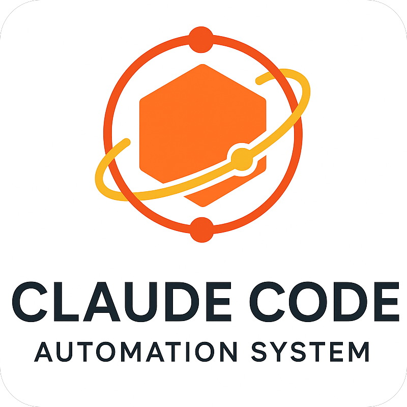

<div align="center">
  
  
# Claude Code 自动化系统
</div>

[](https://www.python.org/downloads/)
[](https://github.com/anthropics/claude-code)
[](LICENSE)
[](https://claude.ai/code)

**基于 Python 的高级 Claude Code 自动化框架，具备智能钩子、自定义命令和多语言代码库分析功能。**

这个仓库提供了一个复杂的双层自动化系统，通过上下文感知的提示修改、高级开发工作流程、智能项目分析和基于代码库发现的自动文档生成来扩展 Claude Code 的功能。

## 功能特性

### **原生钩子系统**
- **UserPromptSubmit 钩子** - 基于上下文的智能提示修改
- **标志调度器** - 快捷命令标志（`-ut`、`-debug`、`-quick` 等）即时控制
- **超级思考模式** - 为复杂问题提供深度分析提示
- **简洁回应** - 对简单查询自动提供简短答案
- **学习支持** - 为教育场景提供增强解释
- **摘要模式** - 项目感知的 `-d` 标志处理

### **自定义命令系统**
- **11 个专业命令** - 高级开发工作流程自动化
- **安全分析** (`/security`) - 多层漏洞扫描
- **PR 创建** (`/create-PR`) - 智能拉取请求生成
- **代码重构** (`/refactor`) - 具备分支安全保护的上下文感知代码改进
- **文件审查** (`/file-review`) - 综合代码分析
- **Git 提交** (`/git-commit`) - 超级思考驱动的提交信息生成
- **项目清理** (`/clean-project`) - 具备 git 保护的安全项目清理
- **智能文档生成** (`/create-readme`, `/update-readme`) - **增强版** 多语言代码库分析，自动 API 发现、架构可视化和双语 README 生成

### **上下文智能与代码库分析**
- **多语言项目检测** - 自动识别项目类型（Python、JavaScript/TypeScript、Java、Rust、Go、Docker）
- **高级代码发现** - 基于 AST 的 Python API 分析、函数签名和类层次结构解析
- **跨语言 API 检测** - CLI 工具、Web API 和配置系统的通用模式识别
- **架构分析** - 智能项目结构映射、依赖分析和设计模式检测
- **测试驱动文档** - 从测试套件和集成测试中自动提取工作示例
- **Git 集成** - 分支跟踪、变更分析和提交智能
- **工具验证** - 先决条件检查和环境验证

## 安装

### 🚀 快速设置（推荐）
**只需将 `.claude/` 目录复制到您现有的项目中即可！**

整个自动化系统都包含在 `.claude/` 文件夹中，无需重构项目结构。

```bash
# 方法1：直接下载并解压
curl -L https://github.com/muqy1818/claude-code-automation/archive/master.zip -o automation.zip
unzip automation.zip
cp -r claude-code-automation-master/.claude/ /path/to/your/project/
cd /path/to/your/project/

# 就是这样！所有11个命令和钩子系统现在可用
# 测试是否工作：
echo "测试自动化 -d" | claude
```

### ⚡ 其他安装方法

#### 手动下载
1. 访问 [GitHub 仓库](https://github.com/muqy1818/claude-code-automation)
2. 下载 `.claude/` 文件夹内容
3. 复制到您的项目根目录
4. 在该目录开始使用 Claude Code

#### Git 子树（适用于 Git 用户）
```bash
cd your-existing-project/
git subtree add --prefix=.claude https://github.com/muqy1818/claude-code-automation.git master --squash
```

#### 完整仓库克隆（用于开发）
```bash
# 仅在贡献代码或学习代码库时需要
git clone https://github.com/muqy1818/claude-code-automation.git
cd claude-code-automation
# 准备就绪用于开发和测试
```

### ✅ 您将获得什么
一旦 `.claude/` 在您的项目中：
- **11个专业命令**（`/security`、`/create-PR`、`/refactor` 等）
- **智能钩子系统**（超级思考、简洁回应、摘要模式）
- **上下文感知自动化**（检测您的项目类型和语言）
- **安全第一设计**（分支保护、备份、预览模式）
- **双语文档**支持

### 先决条件
- **Claude Code CLI** 已安装并配置
- **Python 3.8+**（用于自动化框架）
- **Git**（用于git相关命令和安全功能）
- **可选**：GitHub CLI (`gh`) 用于PR创建，Node.js/npm 用于Web项目

## 快速开始

### 1. **启用钩子系统**
当您在此目录中使用 Claude Code 时，钩子系统会自动激活：

```bash
# 测试 -d 摘要模式
echo "解释钩子如何工作 -d" | claude

# 测试超级思考模式
echo "设计可扩展的微服务架构" | claude
```

### 2. **使用自定义命令**
通过斜杠命令访问高级自动化：

```bash
# 生成安全分析
/security

# 安全清理项目（新功能）
/clean-project --dry-run

# 创建智能 README（双语）
/create-readme --lang=both --style=standard

# 智能 PR 创建
/create-PR --draft

# 上下文感知重构（安全：需要新分支）
/refactor --type=performance
```

## 使用方法

### 钩子系统
自动化系统通过 **两层** 运作：

#### **第一层：原生 Claude Code 钩子**
- 在到达 Claude 之前修改提示
- 在 `.claude/settings.json` 中配置
- 按序执行：flag_dispatcher → ultrathink → answer_in_short → explain → default

```bash
# 钩子激活示例
"复杂算法设计问题"                    # → 触发超级思考
"什么是 Python？"                    # → 触发简洁回应
"帮我学习递归"                       # → 触发解释模式
"优化这段代码 -d"                    # → 触发摘要模式

# 新的快捷标志示例
"设计微服务架构 -ut"                  # → 强制超级思考模式
"分析这个错误 -debug"                # → 激活调试分析
"简单问题 -quick"                    # → 强制简短回答
"解释概念 -explain"                  # → 强制详细解释
```

#### **第二层：自定义命令系统**
- 高级开发工作流程
- 上下文感知执行
- 由 `/core` Python 框架驱动

### 快捷标志系统

**标志调度器** 通过快捷标志提供对 Claude 回应风格的即时控制：

#### **可用标志**
```bash
# 核心标志（用户请求）
-ut              # 超级思考 - 带综合推理的深度分析
-debug           # 调试模式 - 系统性错误分析和故障排除

# 额外控制标志
-quick           # 快速模式 - 仅简短、简洁的答案（与 -ut、-debug、-explain 冲突）
-explain         # 解释模式 - 详细解释和教学
-code            # 代码模式 - 专注实现，最少解释
-review          # 审查模式 - 代码审查与最佳实践
-secure          # 安全模式 - 专注安全影响
-optimize        # 优化模式 - 性能和效率专注
-refactor        # 重构模式 - 代码重构建议
-test            # 测试模式 - 测试策略和实现
```

#### **标志使用示例**
```bash
# 为复杂问题强制超级思考
"我应该如何架构分布式系统？ -ut"

# 简单问题快速回答
"什么是 Python？ -quick"

# 组合兼容标志
"审查这段代码的安全问题 -review -secure"

# 错误分析调试模式
"我遇到了这个错误：[错误详情] -debug"
```

#### **冲突解决**
- 冲突标志（如 `-quick` 和 `-explain`）自动解决
- 第一个检测到的标志优先
- 系统提供清洁、可预测的行为

### 自定义命令

#### **文档命令**
```bash
# 生成新的 README
/create-readme --lang=en --style=comprehensive
/create-readme --lang=zh --style=minimal
/create-readme --lang=both --style=standard

# 更新现有 README
/update-readme --sections=installation,usage
/update-readme --lang=both --preserve=true
```

#### **开发命令**
```bash
# 安全分析
/security secrets              # 扫描硬编码秘密
/security dependencies         # 检查易受攻击的依赖
/security full                # 完整安全审计

# 项目清理（新功能）
/clean-project --dry-run       # 预览清理（安全）
/clean-project --mode=moderate # 更彻底的清理
/clean --mode=safe            # 基本清理的别名

# 代码改进（安全：使用功能分支）
git checkout -b refactor/improvements
/refactor src/                # 重构特定目录
/refactor --type=pattern      # 提取模式并减少重复
/file-review --focus=security # 以安全为重点的代码审查
```

#### **Git 集成**
```bash
# 智能提交生成
/git-commit --dry-run         # 预览生成的提交信息
/git-commit --type=feat       # 覆盖自动检测
/commit --style=conventional  # 使用传统提交的别名

# 拉取请求管理
/create-PR main               # 针对主分支创建 PR
/create-PR --draft            # 创建草稿 PR
/push-to-github              # 经过验证的 git 推送
/explain-pull-request        # 记录架构变更
```

## 架构

系统使用具备全面安全措施的 **双层架构**：

### **核心组件**
- **上下文管理器** (`core/context_manager.py`) - 项目智能和检测
- **命令注册表** (`core/command_registry.py`) - 命令执行和验证
- **钩子调度器** (`core/hook_dispatcher.py`) - 命令级钩子管理
- **原生钩子** (`hooks/UserPromptSubmit/`) - 提示修改脚本

### **安全特性**
- **分支保护** - 修改文件的命令需要功能分支
- **备份创建** - 破坏性操作前自动备份
- **预览模式** - 执行前预览更改
- **Git 安全** - 永不触及主/master分支的危险操作

### **配置系统**
- **原生钩子**：`.claude/settings.json` (Claude Code 格式)
- **自定义命令**：`.claude/settings/commands.json` (命令定义)
- **全局设置**：`.claude/settings/global.json` (系统默认值)
- **项目设置**：`.claude/settings/project.json` (项目特定覆盖)

## 双语支持

系统提供全面的双语文档生成：

### **语言选项**
- `--lang=en` - 英文文档（默认）
- `--lang=zh` - 中文文档
- `--lang=both` - 生成两种语言版本

### **技术方法**
- **英文为主** - 主要文档语言
- **中文本地化** - 技术准确性与文化适应
- **一致结构** - 跨语言的镜像部分
- **技术术语** - 保留英文技术词汇

## 贡献

1. **Fork 仓库**
2. **创建功能分支**：`git checkout -b feature/amazing-feature`
3. **进行更改** 并彻底测试
4. **运行钩子系统测试**：使用各种提示类型进行测试
5. **提交更改**：`git commit -m '添加惊人功能'`
6. **推送到分支**：`git push origin feature/amazing-feature`
7. **开启拉取请求** 使用 `/create-PR` 命令

### **开发环境设置**
```bash
# 用于为自动化框架本身做贡献
git clone https://github.com/muqy1818/claude-code-automation.git
cd claude-code-automation

# 直接测试钩子系统
echo "测试提示 -d" | python .claude/hooks/UserPromptSubmit/append_default.py

# 测试命令系统（通过 Claude Code 接口工作）
/clean-project --dry-run      # 应显示预览而不更改

# 在您自己的项目中测试
cp -r .claude/ /path/to/test/project/
cd /path/to/test/project/
echo "测试集成 -d" | claude
```

## 许可证

本项目在 MIT 许可证下授权 - 详情请参阅 [LICENSE](LICENSE) 文件。

## 安全指南

### **分支安全**
修改文件的命令（`/refactor`、`/header-comments`）需要功能分支：
```bash
git checkout -b feature/your-changes
/refactor  # 现在运行安全
```

### **备份保护**
文档命令（`/create-readme`、`/update-readme`）自动创建备份：
```bash
/update-readme  # 创建 backups/README.md.backup.TIMESTAMP
```

## 致谢

- **Anthropic** - 提供 Claude Code 平台和 API
- **Claude Code 社区** - 提供自动化模式和最佳实践
- **贡献者** - 提供功能增强和错误修复

---

**用心为安全第一的智能开发自动化制作**